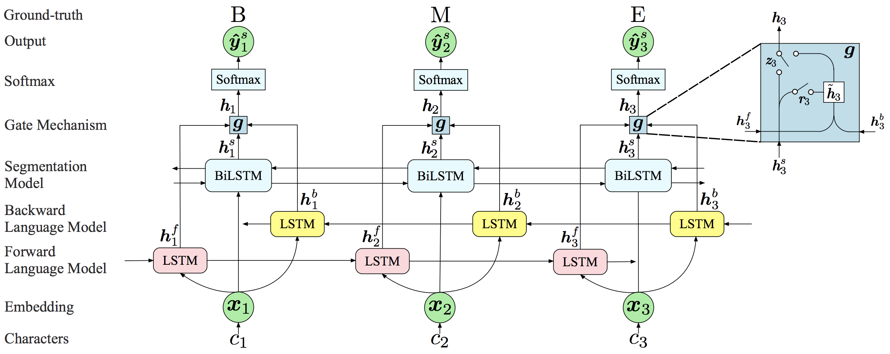

# Cross-Domain-CWS

## About

A TensorFlow implementation of IJCAI 2018 paper "[Neural Networks Incorporating Unlabeled and Partially-labeled Data for Cross-domain Chinese Word Segmentation](http://jkx.fudan.edu.cn/~qzhang/paper/ijcai18_cws.pdf)".

## Model Overview



**Figure**: Architecture of our proposed model. It mainly includes three components: the forward language model (pink), backward language model (yellow), and BiLSTM segmentation model (blue). We use a gate mechanism to control the influence of the language models on the segmentation model. The outputs of language models are not shown for simplicity. In this example, we assume that “c1c2c3” is a word.

## Requirements

- Python: 2.7
- TensorFlow >= 1.4.1 (The used version for experiments in our paper is 1.4.1)

## How to run

1. Bulid vocabulary:

   ```shell
   python utils_data.py
   ```

2. Train a model:

   ```shell
   python train.py --model lstmlm --source ctb --target zx --pl True --memory 1.0
   ```

3. Test a model:

   ```shell
   python test.py --model lstmlm --source ctb --target zx --pl True --memory 1.0
   ```

4. Evaluate a model:

   ```shell
   python eval.py ctb zx lstmlm_ctb_True
   ```


## Citation

 If you find the code helpful, please cite the following paper:

> Lujun Zhao, Qi Zhang, Peng Wang and Xiaoyu Liu, *Neural Networks Incorporating Unlabeled and Partially-labeled Data for Cross-domain Chinese Word Segmentation*, In Proceedings of the 27th International Joint Conference on Artificial Intelligence and the 23rd European Conference on Artificial Intelligence (IJCAI-ECAI-18), July 9-19, 2018, Stockholm, Sweden.

```latex
@InProceedings{zhao2018cws,
  author    = {Zhao, Lujun and Zhang, Qi and Wang, Peng and Liu, Xiaoyu},
  title     = {Neural Networks Incorporating Unlabeled and Partially-labeled Data for Cross-domain Chinese Word Segmentation},
  booktitle = {Proceedings of the 27th International Joint Conference on Artificial Intelligence and the 23rd European Conference on Artificial Intelligence (IJCAI-ECAI-18)},
  year      = {2018},
  address   = {Stockholm, Sweden}
}
```

